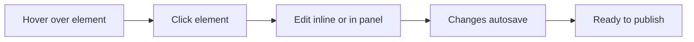

The GitDocAI Visual Editor allows you to build and update your documentation exactly as your users will see it. Instead of filling out clunky forms or switching between tabs, you simply click on any element on the page to edit it instantly.

## The Live Documentation Frame

At the center of your workspace is the **Live Documentation Frame**. This isn't a separate preview window—it *is* your actual documentation. 

When you look at the editor, you'll notice a few key areas:
* **Top Bar:** Quick access to global settings, asset management, and the Publish button.
* **Mini Sidebar:** A contextual menu that displays your page tree and resources, making it easy to navigate between different sections of your docs.
* **The Live Frame:** The main interactive area where your content lives.

> [!TIP]
> **No preview button required!** Because the editor and the preview are the exact same thing, you never have to guess what your published page will look like. 

## Editing Modes

The Visual Editor smartly adapts to what you are trying to do based on where you click.

### 1. Content Mode (Default)
When you are working inside the main body of a page, you are in Content Mode. 
* **Text:** Hover over any paragraph or heading to see its editable borders. Click once to start typing using the inline WYSIWYG (What You See Is What You Get) editor.
* **Images:** Click on any image to instantly open the asset selector and swap it out.
* **Autosave:** All changes are saved automatically as you work.

### 2. Navigation & Layout Mode
If you need to change your site's structure, simply click on the structural elements themselves.
* Clicking the **Navbar** at the top of the frame opens the navigation settings panel.
* Clicking the **Footer** opens the footer configuration.
* You never have to hunt through complex settings menus to change your layout.

## Why use a Visual Editor?

Traditional documentation tools often rely on fragmented forms and markdown files that require you to constantly switch contexts. The GitDocAI Visual Editor removes that friction.

| Feature | Traditional Form-Based Editors | GitDocAI Visual Editor |
|---------|--------------------------------|-------------------------|
| **Content Editing** | Fill out separate forms and text boxes | Click directly on the live content |
| **Previewing** | Requires opening a separate tab or window | The editor *is* the preview |
| **Navbar / Footer** | Buried deep in settings menus | Click the element to open its panel |
| **Publishing Risk** | High (easy to forget to preview changes) | Low (you always see the final result) |
| **Learning Curve** | Medium to High | Low ("Just click what you want to edit") |

> [!NOTE]
> Global settings (like your custom domain or team permissions) are kept logically separated from content editing. You can access them anytime by clicking the **Settings ⚙️** icon in the top bar.

## Frequently Asked Questions

<Accordion>
<AccordionTab title="Where is the preview button?">
There isn't one! The Live Documentation Frame shows you exactly how your page looks in real-time. What you see on your screen is exactly what your users will see when you publish.
</AccordionTab>
<AccordionTab title="Do I need to know Markdown?">
No. While GitDocAI supports Markdown shortcuts for power users, the inline editor provides standard formatting tools (bold, italics, lists) so anyone can write documentation without technical knowledge.
</AccordionTab>
<AccordionTab title="How do I save my changes?">
Changes are saved automatically as you type. When you are ready to make your updates live to the public, simply click the **Publish** button in the top bar.
</AccordionTab>
</Accordion>

## Next Steps

Ready to start building? Explore these guides to dive deeper into the editor's capabilities:

<Card title="Managing Pages" icon="pi pi-file" href="/docs/managing-pages">
Learn how to add, reorder, and organize your documentation pages using the Mini Sidebar.
</Card>

<Card title="Publishing Your Docs" icon="pi pi-cloud" href="/docs/publishing">
Understand how versioning works and how to push your live changes to the web.
</Card>